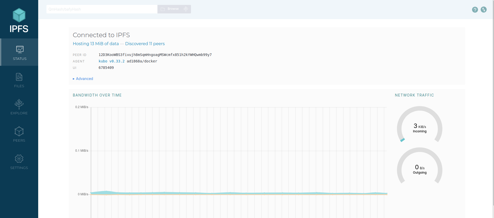
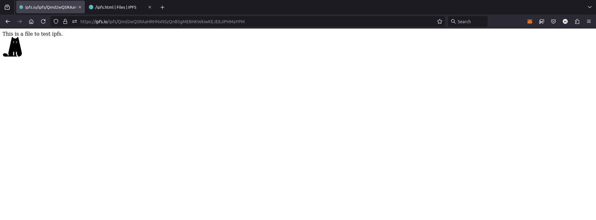
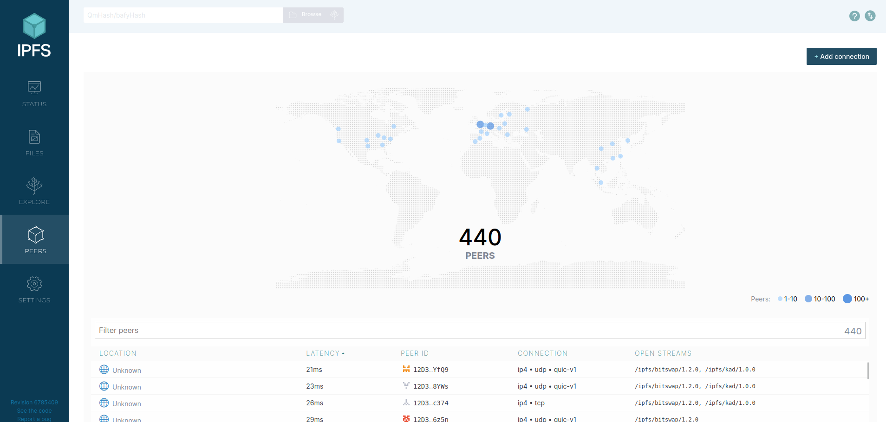
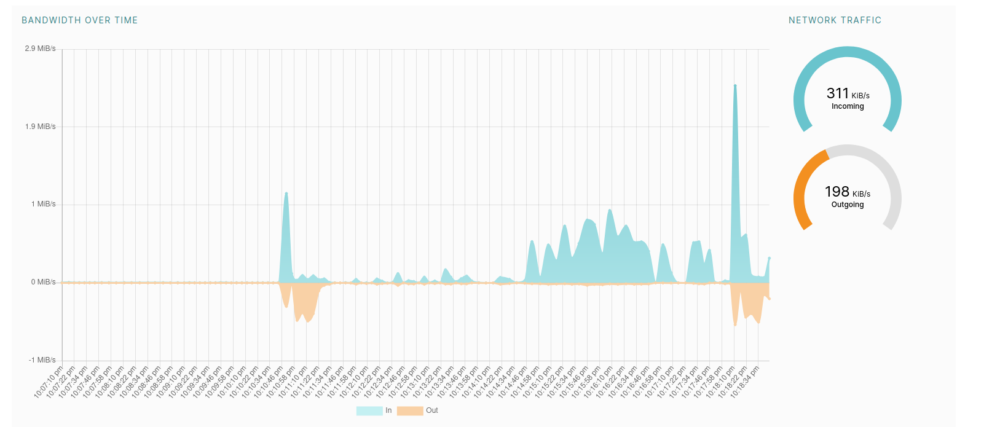

# IPFS and Fleek

## Overview

## IPFS

### Setting up IPFS

After pulling and running the [image](https://hub.docker.com/r/ipfs/go-ipfs/), we can check on the container to make sure its working:
```bash
$ docker ps
CONTAINER ID   IMAGE          COMMAND                  CREATED         STATUS                   PORTS                                                                                                                                                 NAMES
42a07c46eb15   ipfs/go-ipfs   "/sbin/tini -- /usr/…"   7 minutes ago   Up 7 minutes (healthy)   0.0.0.0:4001->4001/tcp, :::4001->4001/tcp, 0.0.0.0:5001->5001/tcp, :::5001->5001/tcp, 4001/udp, 0.0.0.0:8080->8080/tcp, :::8080->8080/tcp, 8081/tcp   ipfs_host
```



### Working with IPFS

After gaining access to the IPFS UI, I uploaded a file by going to files > import > file.


**The CID for the file:** `Qmd2wQSRAaHRHNxNSzQnB5gMEBHKWkiwKEJE8JiPHMaYPM`

I copied the `CID` hash so I can use it to access my file through an [IPFS Public Gateway](https://ipfs.io/ipfs) following the [documentation](https://docs.ipfs.tech/how-to/address-ipfs-on-web/#cid)



The IPFS UI provide us with information about the network we are are in, like the number of peers that are connected to the network with us, where they're from, their ID, and their connection type and latency.



We can also observe the our network traffic and bandwidth over time.



## Fleek

