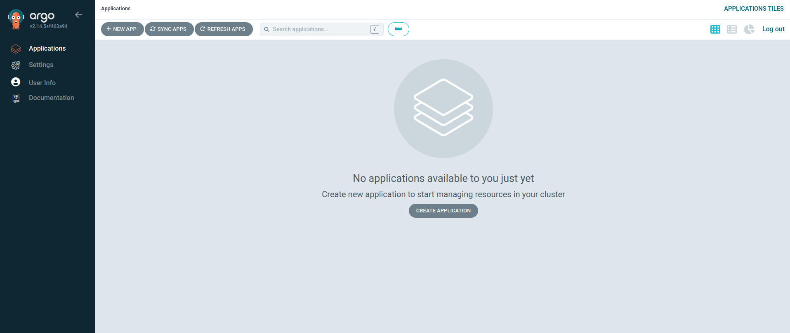
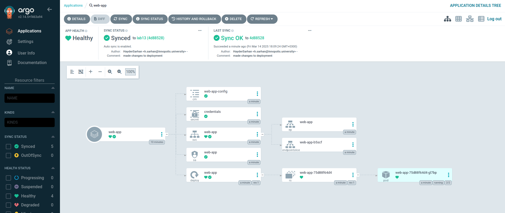

# ArgoCD

## Overview
This document gives an overview over ArgoCD running on app

## Deployment and Configuration

We first have to:
- [Add ArgoCD to Helm](https://argoproj.github.io/argo-helm/) and install it
- Install [ArgoCD CLI](https://argo-cd.readthedocs.io/en/stable/cli_installation/#download-latest-stable-version)

Then we do port-forwarding to get access to the API server\
Resources:
- [Port Forwarding](https://argo-cd.readthedocs.io/en/stable/getting_started/#port-forwarding)
- [Login Using The CLI](https://argo-cd.readthedocs.io/en/stable/getting_started/#4-login-using-the-cli)



To add an app an ArgoCD manifest was created `ArgoCD/argocd-python-app.yaml`



After making changes to our app:


```bash
$ argocd app get web-app
Name:               argocd/web-app
Project:            default
Server:             https://kubernetes.default.svc
Namespace:          default
URL:                https://argocd.example.com/applications/web-app
Source:
- Repo:             https://github.com/HayderSarhan/S25-core-course-labs.git
  Target:           lab13
  Path:             k8s/web-app
  Helm Values:      values.yaml,secrets.yaml
SyncWindow:         Sync Allowed
Sync Policy:        Automated (Prune)
Sync Status:        Synced to lab13 (4c4b9c7)
Health Status:      Healthy

GROUP  KIND            NAMESPACE  NAME              STATUS     HEALTH   HOOK      MESSAGE
       Pod             default    preinstall-hook   Succeeded           PreSync   pod/preinstall-hook created
       ServiceAccount  default    web-app           Synced                        serviceaccount/web-app unchanged
       Secret          default    credentials       Synced                        secret/credentials unchanged
       ConfigMap       default    web-app-config    Synced                        configmap/web-app-config unchanged
       Service         default    web-app           Synced     Healthy            service/web-app unchanged
apps   Deployment      default    web-app           Synced     Healthy            deployment.apps/web-app configured
       Pod             default    postinstall-hook  Succeeded           PostSync  pod/postinstall-hook created
```
## Multi-Environment Deployment

We create two new environments:
- Create 2 new value files for each enviroment (`web-app/values-dev.yaml` and `web-app/values-prod.yaml`)
- Create 2 new ArgoCD manifests (`ArgoCD/argocd-python-dev.yaml` and `ArgoCD/argocd-python-prod.yaml`)\
I used [Create Namespace](https://argo-cd.readthedocs.io/en/stable/user-guide/sync-options/#create-namespace) to automatically create the namespaces for the environments through the ArgoCD manifests.

