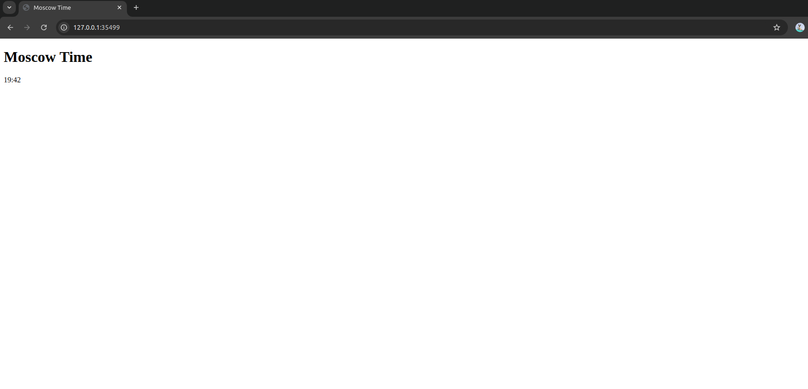

# StatefulSet

## Overview

This document gives an overview over StatefulSets in Kubernetes

## Implementing statefulset into the helm chart

After going through the [documentation for statefulset](https://kubernetes.io/docs/tutorials/stateful-application/basic-stateful-set/#creating-a-statefulset) I made the changes needed to convert the deployment file we have into a statefulset file.

After running an debugging:

```bash
$ helm list
NAME    NAMESPACE REVISION UPDATED                                 STATUS   CHART         APP VERSION
vault   default   1        2025-03-14 21:24:42.954846817 +0300 MSK deployed vault-0.29.1  1.18.1
web-app default   1        2025-03-15 19:35:55.546674647 +0300 MSK deployed web-app-0.1.0 1.16.0
```

## StatefulSet Exploration and Optimization

### Checking the app

```bash
$ kubectl get po,sts,svc,pvc
NAME                                        READY   STATUS    RESTARTS      AGE
pod/vault-0                                 1/1     Running   1 (20h ago)   22h
pod/vault-agent-injector-66f45b5fd5-kggct   1/1     Running   1 (20h ago)   22h
pod/web-app-0                               2/2     Running   0             7m27s
pod/web-app-1                               2/2     Running   0             7m24s

NAME                       READY   AGE
statefulset.apps/vault     1/1     22h
statefulset.apps/web-app   2/2     7m48s

NAME                               TYPE        CLUSTER-IP       EXTERNAL-IP   PORT(S)             AGE
service/kubernetes                 ClusterIP   10.96.0.1        <none>        443/TCP             23h
service/vault                      ClusterIP   10.109.122.169   <none>        8200/TCP,8201/TCP   22h
service/vault-agent-injector-svc   ClusterIP   10.98.86.95      <none>        443/TCP             22h
service/vault-internal             ClusterIP   None             <none>        8200/TCP,8201/TCP   22h
service/web-app                    ClusterIP   10.110.67.117    <none>        5000/TCP            7m48s

NAME                                          STATUS   VOLUME                                     CAPACITY   ACCESS MODES   STORAGECLASS   VOLUMEATTRIBUTESCLASS   AGE
persistentvolumeclaim/web-app-vol-web-app-0   Bound    pvc-3e1d3797-61b2-4d89-bde9-05d280092bf7   1Gi        RWO            standard       <unset>                 125m
persistentvolumeclaim/web-app-vol-web-app-1   Bound    pvc-bf26f006-c8d1-4a76-946e-b98b4cdacb5e   1Gi        RWO            standard       <unset>                 106m
```

### Accessing the app

```bash
$ minikube service web-app
|-----------|---------|-------------|--------------|
| NAMESPACE |  NAME   | TARGET PORT |     URL      |
|-----------|---------|-------------|--------------|
| default   | web-app |             | No node port |
|-----------|---------|-------------|--------------|
😿  service default/web-app has no node port
❗  Services [default/web-app] have type "ClusterIP" not meant to be exposed, however for local development minikube allows you to access this !
🏃  Starting tunnel for service web-app.
|-----------|---------|-------------|------------------------|
| NAMESPACE |  NAME   | TARGET PORT |          URL           |
|-----------|---------|-------------|------------------------|
| default   | web-app |             | http://127.0.0.1:35499 |
|-----------|---------|-------------|------------------------|
🎉  Opening service default/web-app in default browser...
❗  Because you are using a Docker driver on linux, the terminal needs to be open to run it.
```



### Checking the content of the pods

- **pod/web-app-0**

    ```bash
    $ kubectl exec pod/web-app-0 -- cat visits
    Defaulted container "web-app" out of: web-app, vault-agent, vault-agent-init (init)
    6
    ```

- **pod/web-app-1**

    ```bash
    $ kubectl exec pod/web-app-1 -- cat visits
    Defaulted container "web-app" out of: web-app, vault-agent, vault-agent-init (init)
    3
    ```

This is happening because each pod has its own volume that it writes data on, and that explains why we're getting different data from each pod, since the pods don't share a single volume between them to read/write from.

### Storage Persistence

After deleting `pod/web-app-0`, we check on the volumes:

```bash
$ kubectl get po,pvc
NAME                                        READY   STATUS    RESTARTS      AGE
pod/vault-0                                 1/1     Running   1 (20h ago)   22h
pod/vault-agent-injector-66f45b5fd5-kggct   1/1     Running   1 (20h ago)   22h
pod/web-app-0                               2/2     Running   0             7s
pod/web-app-1                               2/2     Running   0             8m17s

NAME                                          STATUS   VOLUME                                     CAPACITY   ACCESS MODES   STORAGECLASS   VOLUMEATTRIBUTESCLASS   AGE
persistentvolumeclaim/web-app-vol-web-app-0   Bound    pvc-3e1d3797-61b2-4d89-bde9-05d280092bf7   1Gi        RWO            standard       <unset>                 136m
persistentvolumeclaim/web-app-vol-web-app-1   Bound    pvc-bf26f006-c8d1-4a76-946e-b98b4cdacb5e   1Gi        RWO            standard       <unset>                 117m
```

We notice that even after the pod have been deleted and re-deployed recently, the volume didn't get deleted since it's been up for a long time.

If we check on the data:

```bash
$ kubectl exec pod/web-app-0 -- cat visits
Defaulted container "web-app" out of: web-app, vault-agent, vault-agent-init (init)
1
```

We notice that the data have been overwritten, and that happened because the pod got re-deployed and it initialized the visits file again.

### Headless service

```bash
$ kubectl exec pod/web-app-0 -- nslookup web-app-1.web-app.default.svc.cluster.local
Defaulted container "web-app" out of: web-app, vault-agent, vault-agent-init (init)
Server:  10.96.0.10
Address: 10.96.0.10:53


Name: web-app-1.web-app.default.svc.cluster.local
Address: 10.244.0.114
```

Each service has its own ip address.

### Monitoring & Alerts

Liveness and readiness probs have been added to the StatefulSet, to check:

```bash
$ kubectl describe pod web-app-0 | grep "Liveness"
    Liveness:       http-get http://:http/ delay=0s timeout=1s period=10s #success=1 #failure=3
```

```bash
$ kubectl describe pod web-app-0 | grep "Readiness"
    Readiness:      http-get http://:http/ delay=0s timeout=1s period=10s #success=1 #failure=3
```

- **How probes ensure pod health**

    Kubernetes uses liveness and readiness probes to check if a pod is working properly.

  - **[Liveness Probe:](https://kubernetes.io/docs/tasks/configure-pod-container/configure-liveness-readiness-startup-probes/#define-a-liveness-command)** Checks if the app is still running. If it fails, Kubernetes restarts the pod to fix any issues.

    - **[Readiness Probe:](https://kubernetes.io/docs/tasks/configure-pod-container/configure-liveness-readiness-startup-probes/#define-readiness-probes)** Ensures the app is ready to handle traffic. If it fails, the pod is temporarily taken out of service until it’s ready again.

- **Why They’re Critical for Stateful Apps**

    Because stateful apps rely on data and need to stay consistent.
  - Liveness probe help kubernetes restart an app if it stops to minimize problems that my happen during downtime.
    - Readiness probe makes sure that the app isn't overwhelmed with traffic if it's not fully ready to work.

    These two work together to make sure that the app stays stable, reliable and ready to handle data without problems.

### Ordering and Pod Management Policies

- **Why isn't `Ordering guarantees` necessary for my app:**

    Ordering is not important for my app since pods work independently from each other, and the failure of one doesn't effect the other. The work as two separate instances.
    Ordering might be important when it comes to distributed systems for example, where, depending on the architecture the system, having order in the system is important to make it easy to manage the data and keep it in sync.

- **[Pod Management Policies](https://kubernetes.io/docs/concepts/workloads/controllers/statefulset/#pod-management-policies)**

After adding the policy to the system, we notice that the pods get created at the same time with no delay:

```bash
$ kubectl get po
NAME                                    READY   STATUS    RESTARTS      AGE
vault-0                                 1/1     Running   1 (22h ago)   24h
vault-agent-injector-66f45b5fd5-kggct   1/1     Running   1 (22h ago)   24h
web-app-0                               2/2     Running   0             17s
web-app-1                               2/2     Running   0             17s
```
